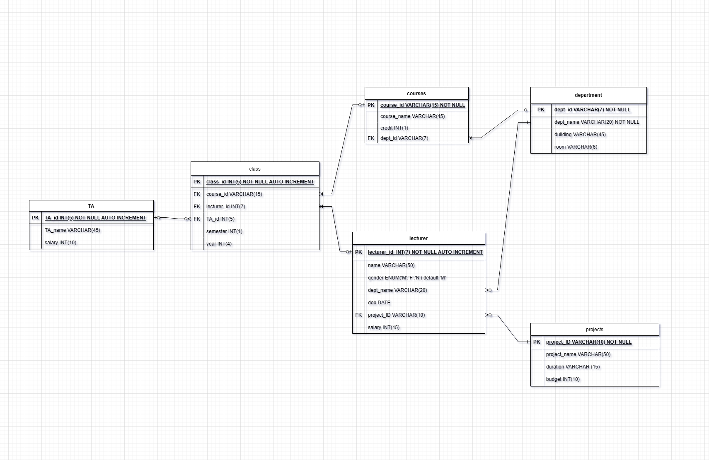

# Lecturer Management
<!-- Add a IU pic there -->

<!-- Preface -->
This project Making a program Manage lecturer's information
</sub> This is a mini project of DMS </sub>

<!-- Map of content -->
## What will be appeared
- [Lecturer Management](#lecturer-management)
  - [What will be appeared](#what-will-be-appeared)
  - [Introduction](#introduction)
  - [ERD](#erd)
  - [Databse design](#databse-design)
  - [Result show](#result-show)

## Introduction

> Project UI power by w3.css

**About team**

|Name|Student ID|
|-|-|
|Ngo Tuan Khai|MAMAIU21016|
|Cai Kim Dat|MAMAIU21040|
|Le Duc Phat|MAMAIU21049|

**About the problem**
To provide a application to perform multiple function on a set data include lecturers, courses, lecturers teach, lecturers do projects

## ERD

**Entities include in database**

<!--> Lecturer entities <-->
|<u>Lecturers information</u>||
|-|-|
||||

<!--> Course entities <-->
|<u>Course information:</u>||
|-|-|
|||

<!--> Department entities <-->
|<u>Deparmentinformation</u>||
|-|-|
|||

<!--> Project entities <-->
|<u>Project information</u>||
|-|-|
|||

**Diagram**

## Databse design

<u>Database:</u> ```lmdb```

**Diagram**



## Result show

